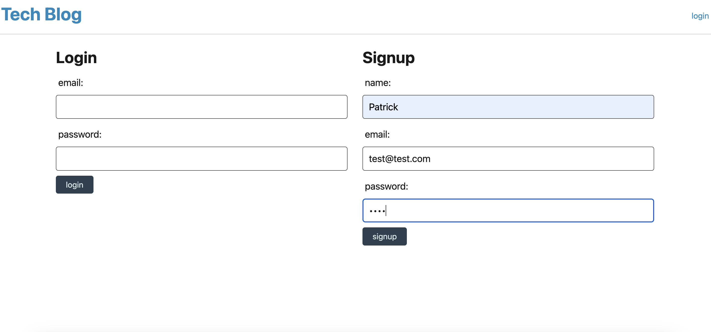

# tech_blog_mvc
CMS Style blog site created with the MVC architecture

# Description
The MVC architecture. Leveraging handlebars, express, sequelize, mysql, express-session, bcrypt, and dotenv. Allows a user to create a profile on the blog site and from their post their thoughts on various technology topics. 

# Technologies Use
-HandlesBars, Express, Express-Session, MySql, Sequelize

# Visuals

# Usage
[githublink](https://github.com/sheehpat/tech_blog_mvc)
[Heroku](https://tech-blog-mvc-sheehan-9e6ee0903dab.herokuapp.com)

# Authors and acknowledgment
Used layout scheme and code examples from the Rutgers Coding Bootcamp to guide the design of the project

# Project status
Completed